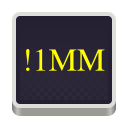
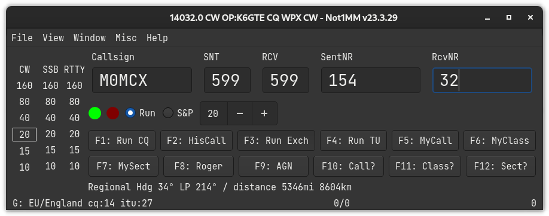

# Not1MM

- [Not1MM](#not1mm)
  - [What and why is Not1MM](#what-and-why-is-not1mm)
  - [What it is not](#what-it-is-not)
  - [Changes of note](#changes-of-note)

## What and why is Not1MM

Not1MM's interface is a blantent ripoff of N1MM.
It is NOT N1MM and any problem you have with this software should in no way reflect on their software.

If you use Windows(tm) you should run their, or some other, program.

I personally don't. While it may be possible to get N1MM working under Wine, I haven't checked, I'd rather not have to jump thru the hoops.

Currently this exists for my own personal amusement.
Something to do in my free time.
While I'm not watching TV, Right vs Left political 'News' programs, mind numbing 'Reality' TV etc...

## What it is not

Working.

The current state is "Not Working". I literally just dragged some widgets out on a Qt Designer window, and wrote a couple stubs to display the interface. Next to nothing is working or useful.

## Changes of note

- [23-2-9] Initial post and name squatting.
